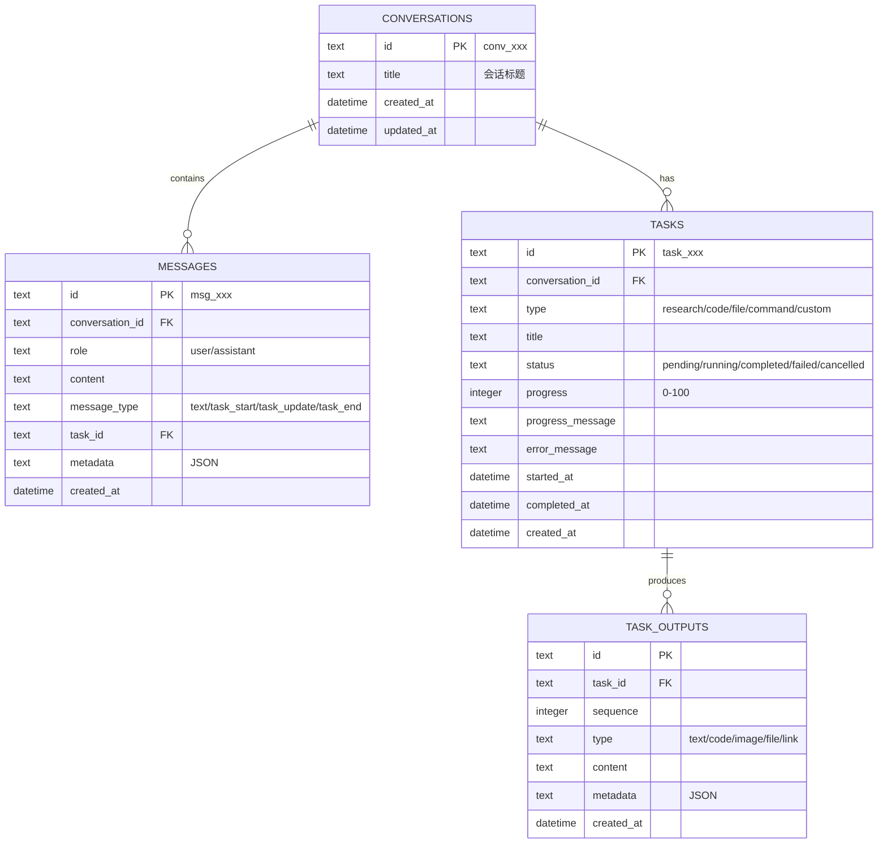
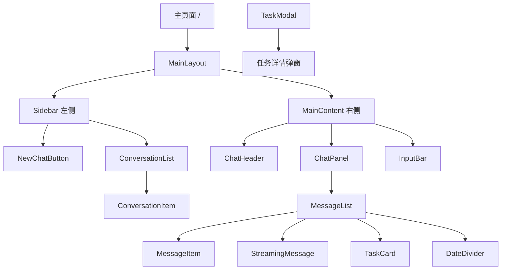

# Openclaw Dashboard - 设计总览

> 创建日期: 2026-03-11
> 状态: 活跃

---

## 1. MVP 功能范围

### 1.1 功能边界图

```
┌─────────────────────────────────────────────────────────────────────────┐
│                         Openclaw Dashboard MVP                           │
├─────────────────────────────────────────────────────────────────────────┤
│                                                                         │
│   ┌─────────────────┐     ┌─────────────────┐     ┌─────────────────┐   │
│   │   会话管理       │     │   实时聊天       │     │   任务追踪       │   │
│   │  ─────────────  │     │  ─────────────  │     │  ─────────────  │   │
│   │  • 创建会话     │     │  • 发送消息     │     │  • 任务卡片     │   │
│   │  • 删除会话     │     │  • 流式响应     │     │  • 进度展示     │   │
│   │  • 切换会话     │     │  • 消息历史     │     │  • 任务详情     │   │
│   │  • 会话列表     │     │  • 消息持久化   │     │  • 任务取消     │   │
│   └─────────────────┘     └─────────────────┘     └─────────────────┘   │
│                                                                         │
│   ┌─────────────────────────────────────────────────────────────────┐   │
│   │                      Openclaw 插件集成                           │   │
│   │  ─────────────────────────────────────────────────────────────  │   │
│   │  • Dashboard Plugin (Channel Plugin)                             │   │
│   │  • WebSocket 双向通信                                            │   │
│   │  • 任务协议解析 (内联标记)                                        │   │
│   └─────────────────────────────────────────────────────────────────┘   │
│                                                                         │
└─────────────────────────────────────────────────────────────────────────┘

                                    │
                                    ▼ 不包含

┌─────────────────────────────────────────────────────────────────────────┐
│                              范围外                                      │
├─────────────────────────────────────────────────────────────────────────┤
│  • 多用户/认证系统 (个人使用)                                            │
│  • 多语言支持 (中文优先)                                                │
│  • 移动端适配 (桌面优先)                                                │
│  • 媒体文件上传 (MVP 暂不支持)                                          │
│  • 消息搜索功能                                                         │
│  • 会话分享/导出                                                        │
└─────────────────────────────────────────────────────────────────────────┘
```

### 1.2 核心用户故事

| ID | 作为 | 我想要 | 以便于 | 优先级 |
|----|------|--------|--------|--------|
| US-01 | 用户 | 创建新的聊天会话 | 开始与 Agent 的新对话 | P0 |
| US-02 | 用户 | 在会话中发送消息 | 与 Agent 进行交互 | P0 |
| US-03 | 用户 | 实时看到 Agent 的流式响应 | 了解 Agent 正在生成的内容 | P0 |
| US-04 | 用户 | 查看历史会话和消息 | 回顾之前的对话 | P0 |
| US-05 | 用户 | 看到任务的进度状态 | 了解 Agent 正在执行的耗时操作 | P1 |
| US-06 | 用户 | 点击任务卡片查看详情 | 了解任务的完整输出 | P1 |
| US-07 | 用户 | 取消正在运行的任务 | 中断不需要的长时间操作 | P2 |

---

## 2. 系统架构

### 2.1 技术栈

| 层级 | 技术 | 用途 |
|------|------|------|
| **前端** | Next.js 14 | React 框架 (App Router) |
| | TypeScript | 类型安全 |
| | Tailwind CSS | 样式系统 |
| | Zustand | 客户端状态管理 |
| | Lucide Icons | 图标库 |
| **后端** | Fastify | Web 框架 |
| | @fastify/websocket | WebSocket 服务 |
| | SQLite (better-sqlite3) | 数据库 |
| | Zod | 数据验证 |
| **插件** | Openclaw Plugin SDK | Channel 插件开发 |
| | ws | WebSocket 客户端 |
| **构建** | pnpm | Monorepo 包管理 |
| | TypeScript | 共享类型 |

### 2.2 架构图

```
┌─────────────────────────────────────────────────────────────────────┐
│                           用户浏览器                                 │
│   ┌─────────────────────────────────────────────────────────────┐   │
│   │                     Next.js Frontend                         │   │
│   │   ┌────────────────────────────────────────────────────┐    │   │
│   │   │                  Chat Panel                         │    │   │
│   │   │   - 消息列表 (MessageList)                          │    │   │
│   │   │   - 任务卡片 (TaskCard)                             │    │   │
│   │   │   - 输入框 (InputBar)                               │    │   │
│   │   └────────────────────────────────────────────────────┘    │   │
│   │                              │                                │   │
│   │              ┌────────────────────────────┐                  │   │
│   │              │    WebSocket Client        │                  │   │
│   │              │    (连接 Dashboard Backend)│                  │   │
│   │              └────────────────────────────┘                  │   │
│   └─────────────────────────────────────────────────────────────┘   │
└─────────────────────────────────────────────────────────────────────┘
                                │
                        WebSocket + HTTP
                                │
                                ▼
┌─────────────────────────────────────────────────────────────────────┐
│                     Dashboard Backend (Server B)                     │
│   ┌─────────────────────────────────────────────────────────────┐   │
│   │                     Core Services                             │   │
│   │   ┌──────────────┐  ┌──────────────┐  ┌──────────────────┐  │   │
│   │   │  WebSocket   │  │    Task      │  │    Message       │  │   │
│   │   │  Server      │  │    Parser    │  │    Store         │  │   │
│   │   │  (前端连接)   │  │  (协议解析)   │  │  (SQLite)       │  │   │
│   │   └──────────────┘  └──────────────┘  └──────────────────┘  │   │
│   │           │                  │                    │          │   │
│   │           └──────────────────┼────────────────────┘          │   │
│   │                              ▼                                │   │
│   │              ┌────────────────────────────┐                  │   │
│   │              │    WebSocket Server        │                  │   │
│   │              │    (接收插件连接)           │                  │   │
│   │              └────────────────────────────┘                  │   │
│   └─────────────────────────────────────────────────────────────┘   │
└─────────────────────────────────────────────────────────────────────┘
                                │
                        WebSocket (Dashboard Protocol)
                                │
                                ▼
┌─────────────────────────────────────────────────────────────────────┐
│                    Openclaw Gateway (Server A)                       │
│   ┌─────────────────────────────────────────────────────────────┐   │
│   │                  Dashboard Plugin                             │   │
│   │   ┌──────────────┐  ┌──────────────┐  ┌──────────────────┐  │   │
│   │   │  Gateway     │  │    Message   │  │    Outbound      │  │   │
│   │   │  (WS Client) │  │    Handler   │  │    (发送消息)     │  │   │
│   │   └──────────────┘  └──────────────┘  └──────────────────┘  │   │
│   └─────────────────────────────────────────────────────────────┘   │
│                                │                                     │
│                                ▼                                     │
│   ┌─────────────────────────────────────────────────────────────┐   │
│   │                    Agent Core                                 │   │
│   │   - 消息处理                                                   │   │
│   │   - 任务执行                                                   │   │
│   │   - 流式响应                                                   │   │
│   └─────────────────────────────────────────────────────────────┘   │
└─────────────────────────────────────────────────────────────────────┘
```

### 2.3 目录结构

```
openclaw-dashboard/
├── apps/
│   ├── web/                          # Next.js 前端 (:3000)
│   │   ├── src/
│   │   │   ├── app/                  # App Router 页面
│   │   │   ├── components/           # React 组件
│   │   │   ├── hooks/                # 自定义 hooks
│   │   │   ├── stores/               # Zustand 状态管理
│   │   │   └── lib/                  # 工具函数
│   │   └── package.json
│   │
│   └── server/                       # Fastify 后端 (:3001)
│       ├── src/
│       │   ├── routes/               # API 路由
│       │   ├── services/             # 业务逻辑
│       │   ├── db/                   # 数据库
│       │   └── index.ts              # 入口
│       └── package.json
│
├── packages/
│   └── shared/
│       └── types/                    # 共享类型定义
│
├── docs/                             # 文档
│   └── prd/                          # PRD 文档体系
│
├── package.json                      # Monorepo 根配置
└── pnpm-workspace.yaml
```

### 2.4 部署配置

| 服务 | 端口 | 启动命令 | 说明 |
|------|------|----------|------|
| Frontend | 3000 | `pnpm dev:web` | Next.js 开发服务器 |
| Backend | 3001 | `pnpm dev:server` | Fastify API + WebSocket |

**环境变量**：

```bash
# server/.env
PORT=3001
HOST=0.0.0.0
DB_PATH=./data/dashboard.db
PLUGIN_TOKEN=your-secure-token

# web/.env.local
NEXT_PUBLIC_API_URL=http://localhost:3001/api/v1
NEXT_PUBLIC_WS_URL=ws://localhost:3001/ws
```

---

## 3. 数据模型

### 3.1 实体关系图



### 3.2 核心实体说明

| 实体 | 说明 | 关键字段 |
|------|------|----------|
| **Conversations** | 聊天会话 | id, title |
| **Messages** | 消息记录 | role, content, message_type |
| **Tasks** | 任务信息 | type, status, progress |
| **TaskOutputs** | 任务输出 | type, content, sequence |

---

## 4. 页面设计

### 4.1 页面层级



### 4.2 页面结构图

```
┌─────────────────────────────────────────────────────────────────────────┐
│                              主页面                                      │
├────────────────────┬────────────────────────────────────────────────────┤
│                    │  ChatHeader (会话标题)                              │
│    Sidebar         ├────────────────────────────────────────────────────┤
│  ┌──────────────┐  │                                                    │
│  │ + 新建对话    │  │    MessageList                                     │
│  ├──────────────┤  │    ┌────────────────────────────────────────────┐  │
│  │ 会话 1       │  │    │ [User] 你好，帮我分析一下...                │  │
│  │ 会话 2       │  │    ├────────────────────────────────────────────┤  │
│  │ 会话 3       │  │    │ [Agent] 好的，我来帮你分析...               │  │
│  │ ...          │  │    ├────────────────────────────────────────────┤  │
│  └──────────────┘  │    │ ┌────────────────────────────────────────┐ │  │
│                    │    │ │ TaskCard                               │ │  │
│                    │    │ │ 🔬 Research: 分析项目结构               │ │  │
│                    │    │ │ ████████████████░░░░  80%              │ │  │
│                    │    │ │ 状态: 运行中 · 2 分钟前                  │ │  │
│                    │    │ └────────────────────────────────────────┘ │  │
│                    │    └────────────────────────────────────────────┘  │
│                    │                                                    │
│                    ├────────────────────────────────────────────────────┤
│                    │  InputBar [输入框...]              [发送]          │
└────────────────────┴────────────────────────────────────────────────────┘
```

### 4.3 操作简表

| 区域 | 操作 | 行为 |
|------|------|------|
| Sidebar | 点击新建 | 创建新会话并切换 |
| Sidebar | 点击会话 | 切换到该会话 |
| Sidebar | 右键会话 | 删除会话 |
| ChatPanel | 输入消息 | 发送用户消息 |
| ChatPanel | 点击 TaskCard | 打开 TaskModal |
| TaskModal | 点击取消任务 | 取消运行中的任务 |

---

## 5. 文档索引

| 文档 | 状态 | 说明 |
|------|------|------|
| [00_PRD_GRAPH.md](./00_PRD_GRAPH.md) | ✅ 当前 | 设计总览 (本文档) |
| [01_PRD.md](./01_PRD.md) | ✅ 已完成 | 产品需求文档 |
| [02_TECH.md](./02_TECH.md) | ✅ 已完成 | 技术架构设计 |
| [03_DATAMODEL.md](./03_DATAMODEL.md) | ✅ 已完成 | 数据模型设计 |
| [04_UX_DESIGN.md](./04_UX_DESIGN.md) | ✅ 已完成 | 用户体验设计 |
| [05_API.md](./05_API.md) | ✅ 已完成 | API 接口规范 |

> **参考文档**：
> - [docs/plans/2026-03-05-openclaw-dashboard-design.md](../plans/2026-03-05-openclaw-dashboard-design.md) - 原始设计文档

---

## 6. 规则索引

| 规则 | 说明 |
|------|------|
| 设计原则 | Dark mode first，速度优先，中文界面 |
| 代码规范 | TypeScript strict mode，函数式组件 |
| API 规范 | RESTful + WebSocket，版本前缀 /api/v1 |
| 任务协议 | 内联标记格式 `[TASK:START:type:title]` |

---

## 7. 更新记录

| 日期 | 变更内容 | 来源 |
|------|----------|------|
| 2026-03-11 | 初始化 PRD 可视化设计看板 | 基于 docs/plans 设计文档 |
