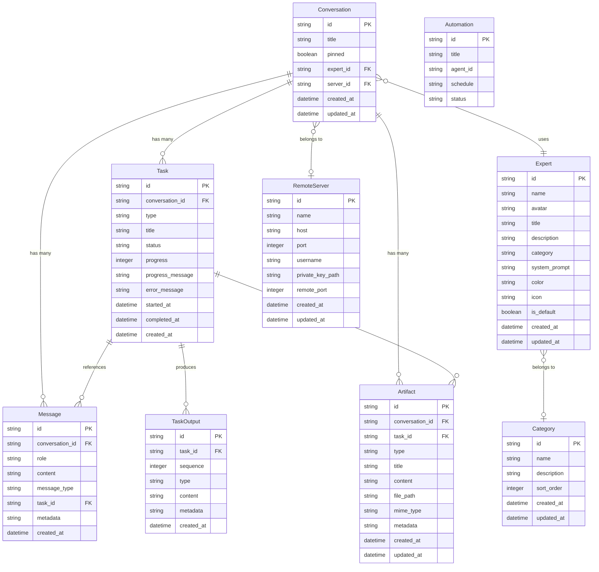

# Openclaw Dashboard - 数据模型设计

*版本：1.2 | 状态：已实现 | 更新时间：2026-03-30*

---

## 1. 模型概述

### 1.1 项目数据库背景

| 项目信息 | 描述 |
|----------|------|
| **数据库类型** | SQLite (sql.js) |
| **ORM/访问方式** | 原生 SQL |
| **数据文件位置** | `apps/server/data/dashboard.db` |
| **Schema 文件** | `apps/server/src/db/schema.sql` |

### 1.2 实体变更总览

> 本文档为已有项目的逆向文档，所有实体均已实现

| 实体 | 类型 | 说明 |
|------|------|------|
| Conversation | 📦 现有 | 会话实体 |
| Message | 📦 现有 | 消息实体 |
| Task | 📦 现有 | 任务实体 |
| TaskOutput | 📦 现有 | 任务输出实体 |
| Expert | 📦 现有 | 专家实体 |
| Category | 📦 现有 | 分类实体 |
| Automation | 📦 现有 | 自动化实体 |
| Artifact | 📦 现有 | 产物实体 |
| Rule | 🆕 新增 | 规则实体 |
| RemoteServer | 🆕 新增 | 远程服务器配置实体 |

### 1.3 核心实体关系总览

```
会话 (Conversation) 是核心实体，关联：
├── 消息 (Message) - 1:N
├── 任务 (Task) - 1:N
└── 产物 (Artifact) - 1:N

任务 (Task) 产生：
├── 任务输出 (TaskOutput) - 1:N
└── 产物 (Artifact) - 1:N

专家 (Expert) 关联：
├── 分类 (Category) - N:1
└── 会话 (Conversation) - 1:N

自动化 (Automation) 为独立实体

规则 (Rule) 为独立实体，用于会话初始化

远程服务器 (RemoteServer) 为独立实体，通过 server_id 关联：
└── 会话 (Conversation) - N:1
```

---

## 2. 实体关系图



---

## 3. 实体详细定义

### 3.1 Conversation（会话）

> 核心实体，代表用户与 AI 的一次完整对话

| 字段 | 类型 | 约束 | 默认值 | 说明 |
|------|------|------|--------|------|
| `id` | TEXT | PK | - | UUID，格式：`conv_xxx` |
| `title` | TEXT | - | NULL | 会话标题（首个用户消息自动生成） |
| `pinned` | INTEGER | - | 0 | 是否置顶 (0: 否, 1: 是) |
| `expert_id` | TEXT | FK, NULL | - | 关联的专家 ID |
| `server_id` | TEXT | FK, NULL | - | 关联的远程服务器 ID（null 为本地） |
| `created_at` | DATETIME | - | CURRENT_TIMESTAMP | 创建时间 |
| `updated_at` | DATETIME | - | CURRENT_TIMESTAMP | 更新时间 |

**索引**：无（主键索引）

**关系**：
- `has_many` Message
- `has_many` Task
- `has_many` Artifact
- `belongs_to` Expert (可选)

---

### 3.2 Message（消息）

> 会话中的单条消息，用户或 AI 的回复

| 字段 | 类型 | 约束 | 默认值 | 说明 |
|------|------|------|--------|------|
| `id` | TEXT | PK | - | UUID，格式：`msg_xxx` |
| `conversation_id` | TEXT | FK, NOT NULL | - | 所属会话 ID |
| `role` | TEXT | NOT NULL | - | 角色：`user` / `assistant` |
| `content` | TEXT | NOT NULL | - | 消息内容 |
| `message_type` | TEXT | - | `text` | 类型：`text` / `task_start` / `task_update` / `task_end` |
| `task_id` | TEXT | FK, NULL | - | 关联的任务 ID |
| `metadata` | TEXT | - | NULL | JSON 元数据 |
| `created_at` | DATETIME | - | CURRENT_TIMESTAMP | 创建时间 |

**索引**：
- `idx_messages_conversation` ON (conversation_id)
- `idx_messages_task` ON (task_id)

**关系**：
- `belongs_to` Conversation
- `belongs_to` Task (可选)

---

### 3.3 Task（任务）

> AI 执行的异步任务

| 字段 | 类型 | 约束 | 默认值 | 说明 |
|------|------|------|--------|------|
| `id` | TEXT | PK | - | UUID，格式：`task_xxx` |
| `conversation_id` | TEXT | FK, NOT NULL | - | 所属会话 ID |
| `type` | TEXT | NOT NULL | - | 类型：`research` / `code` / `file` / `command` / `custom` |
| `title` | TEXT | - | NULL | 任务标题 |
| `status` | TEXT | - | `pending` | 状态：`pending` / `running` / `completed` / `failed` / `cancelled` |
| `progress` | INTEGER | - | 0 | 进度 0-100 |
| `progress_message` | TEXT | - | NULL | 当前进度消息 |
| `error_message` | TEXT | - | NULL | 失败时的错误信息 |
| `started_at` | DATETIME | - | NULL | 开始时间 |
| `completed_at` | DATETIME | - | NULL | 完成时间 |
| `created_at` | DATETIME | - | CURRENT_TIMESTAMP | 创建时间 |

**索引**：
- `idx_tasks_conversation` ON (conversation_id)
- `idx_tasks_status` ON (status)

**关系**：
- `belongs_to` Conversation
- `has_many` TaskOutput
- `has_many` Message
- `has_many` Artifact

---

### 3.4 TaskOutput（任务输出）

> 任务产生的结构化输出

| 字段 | 类型 | 约束 | 默认值 | 说明 |
|------|------|------|--------|------|
| `id` | TEXT | PK | - | UUID |
| `task_id` | TEXT | FK, NOT NULL | - | 所属任务 ID |
| `sequence` | INTEGER | - | 0 | 输出顺序 |
| `type` | TEXT | NOT NULL | - | 类型：`text` / `code` / `image` / `file` / `link` |
| `content` | TEXT | - | NULL | 输出内容 |
| `metadata` | TEXT | - | NULL | JSON 元数据（language, filename, url 等） |
| `created_at` | DATETIME | - | CURRENT_TIMESTAMP | 创建时间 |

**索引**：
- `idx_task_outputs_task` ON (task_id)

**关系**：
- `belongs_to` Task

---

### 3.5 Expert（专家）

> 预配置的 AI 角色/专家

| 字段 | 类型 | 约束 | 默认值 | 说明 |
|------|------|------|--------|------|
| `id` | TEXT | PK | - | UUID，格式：`expert_xxx` |
| `name` | TEXT | NOT NULL | - | 专家名称 |
| `avatar` | TEXT | - | NULL | 头像 URL |
| `title` | TEXT | NOT NULL | - | 头衔 |
| `description` | TEXT | - | NULL | 简介 |
| `category` | TEXT | NULL | - | 分类名称 |
| `system_prompt` | TEXT | NOT NULL | - | 系统提示词 |
| `color` | TEXT | - | NULL | 主题色（如 `#0ea5e9`） |
| `icon` | TEXT | - | NULL | 图标名称（Lucide 图标） |
| `is_default` | INTEGER | - | 0 | 是否为默认专家 (0: 否, 1: 是) |
| `created_at` | DATETIME | - | CURRENT_TIMESTAMP | 创建时间 |
| `updated_at` | DATETIME | - | CURRENT_TIMESTAMP | 更新时间 |

**索引**：
- `idx_experts_category` ON (category)

**关系**：
- `belongs_to` Category (通过 category 字段关联)
- `has_many` Conversation

---

### 3.6 Category（分类）

> 专家分类

| 字段 | 类型 | 约束 | 默认值 | 说明 |
|------|------|------|--------|------|
| `id` | TEXT | PK | - | UUID |
| `name` | TEXT | NOT NULL, UNIQUE | - | 分类名称 |
| `description` | TEXT | - | NULL | 分类描述 |
| `sort_order` | INTEGER | - | 0 | 排序顺序 |
| `created_at` | DATETIME | - | CURRENT_TIMESTAMP | 创建时间 |
| `updated_at` | DATETIME | - | CURRENT_TIMESTAMP | 更新时间 |

**索引**：
- `idx_categories_sort` ON (sort_order)
- UNIQUE (name)

**关系**：
- `has_many` Expert (通过 category 名称关联)

---

### 3.7 Automation（自动化）

> 定时执行的自动化任务

| 字段 | 类型 | 约束 | 默认值 | 说明 |
|------|------|------|--------|------|
| `id` | TEXT | PK | - | UUID，格式：`auto_xxx` |
| `title` | TEXT | NOT NULL | - | 任务名称 |
| `description` | TEXT | - | NULL | 任务描述 |
| `agent_id` | TEXT | NOT NULL | - | 执行的 Agent ID |
| `schedule` | TEXT | NOT NULL | - | Cron 表达式 |
| `schedule_description` | TEXT | - | NULL | 人类可读的调度描述 |
| `status` | TEXT | - | `active` | 状态：`active` / `paused` / `deleted` |
| `last_run_at` | DATETIME | - | NULL | 上次执行时间 |
| `next_run_at` | DATETIME | - | NULL | 下次执行时间 |
| `created_at` | DATETIME | - | CURRENT_TIMESTAMP | 创建时间 |
| `updated_at` | DATETIME | - | CURRENT_TIMESTAMP | 更新时间 |

**索引**：
- `idx_automations_status` ON (status)

**关系**：独立实体，无外键关联

---

### 3.8 Artifact（产物）

> AI 生成的文件/代码/图片等产物

| 字段 | 类型 | 约束 | 默认值 | 说明 |
|------|------|------|--------|------|
| `id` | TEXT | PK | - | UUID，格式：`artifact_xxx` |
| `conversation_id` | TEXT | FK, NOT NULL | - | 所属会话 ID |
| `task_id` | TEXT | FK, NULL | - | 关联任务 ID |
| `type` | TEXT | NOT NULL | - | 类型：`document` / `code` / `image` / `file` |
| `title` | TEXT | NOT NULL | - | 产物标题 |
| `content` | TEXT | - | NULL | 产物内容（文本类） |
| `file_path` | TEXT | - | NULL | 文件路径 |
| `mime_type` | TEXT | - | NULL | MIME 类型 |
| `metadata` | TEXT | - | NULL | JSON 元数据 |
| `created_at` | DATETIME | - | CURRENT_TIMESTAMP | 创建时间 |
| `updated_at` | DATETIME | - | CURRENT_TIMESTAMP | 更新时间 |

**索引**：
- `idx_artifacts_conversation` ON (conversation_id)
- `idx_artifacts_task` ON (task_id)

**关系**：
- `belongs_to` Conversation
- `belongs_to` Task (可选)

---

### 3.9 RemoteServer（远程服务器）

> 远程 OpenClaw 服务器配置

| 字段 | 类型 | 约束 | 默认值 | 说明 |
|------|------|------|--------|------|
| `id` | TEXT | PK | - | UUID，格式：`server_xxx` |
| `name` | TEXT | NOT NULL | - | 服务器名称（如"北京生产环境"） |
| `host` | TEXT | NOT NULL | - | 服务器地址 |
| `port` | INTEGER | - | 22 | SSH 端口 |
| `username` | TEXT | NOT NULL | - | SSH 用户名 |
| `private_key_path` | TEXT | - | NULL | SSH 私钥路径 |
| `remote_port` | INTEGER | - | 3001 | remote-server 监听端口 |
| `created_at` | DATETIME | - | CURRENT_TIMESTAMP | 创建时间 |
| `updated_at` | DATETIME | - | CURRENT_TIMESTAMP | 更新时间 |

**索引**：无（主键索引）

**关系**：
- `has_many` Conversation (可选)

---

## 4. 枚举定义

### 4.1 MessageRole（消息角色）

| 值 | 说明 |
|----|------|
| `user` | 用户消息 |
| `assistant` | AI 助手消息 |

### 4.2 MessageType（消息类型）

| 值 | 说明 |
|----|------|
| `text` | 普通文本消息 |
| `task_start` | 任务开始消息 |
| `task_update` | 任务更新消息 |
| `task_end` | 任务结束消息 |

### 4.3 TaskType（任务类型）

| 值 | 说明 |
|----|------|
| `research` | 研究任务 |
| `code` | 代码任务 |
| `file` | 文件任务 |
| `command` | 命令任务 |
| `custom` | 自定义任务 |

### 4.4 TaskStatus（任务状态）

| 值 | 说明 |
|----|------|
| `pending` | 待执行 |
| `running` | 执行中 |
| `completed` | 已完成 |
| `failed` | 失败 |
| `cancelled` | 已取消 |

### 4.5 TaskOutputType（任务输出类型）

| 值 | 说明 |
|----|------|
| `text` | 文本 |
| `code` | 代码 |
| `image` | 图片 |
| `file` | 文件 |
| `link` | 链接 |

### 4.6 ArtifactType（产物类型）

| 值 | 说明 |
|----|------|
| `document` | 文档 |
| `code` | 代码 |
| `image` | 图片 |
| `file` | 文件 |

### 4.7 Rule（规则）

> 会话初始化规则，注入到 agent 的 systemPrompt

| 字段 | 类型 | 约束 | 默认值 | 说明 |
|------|------|------|--------|------|
| `id` | TEXT | PK | - | UUID，格式：`rule_xxx` |
| `name` | TEXT | NOT NULL | - | 规则名称 |
| `description` | TEXT | - | NULL | 规则描述 |
| `template` | TEXT | NOT NULL | - | 规则模板（支持 `{{var}}` 变量） |
| `variables` | TEXT | - | NULL | JSON 数组定义需要的变量，如 `["conversationId", "workDir"]` |
| `is_enabled` | INTEGER | - | 1 | 是否启用 (0: 否, 1: 是) |
| `priority` | INTEGER | - | 0 | 优先级（越大越先注入） |
| `created_at` | DATETIME | - | CURRENT_TIMESTAMP | 创建时间 |
| `updated_at` | DATETIME | - | CURRENT_TIMESTAMP | 更新时间 |

**索引**：
- `idx_rules_enabled` ON (is_enabled)
- `idx_rules_priority` ON (priority)

**关系**：独立实体，无外键关联

**模板变量**：

| 变量 | 说明 | 来源 |
|------|------|------|
| `{{conversationId}}` | 当前会话 ID | orchestrator |
| `{{workDir}}` | 会话工作目录 | orchestrator |
| `{{cwd}}` | 服务器当前目录 | process.cwd() |

**示例模板**：

```markdown
## 文件保存协议
你的工作目录是: {{workDir}}/

当你保存文件时，必须：
1. 将文件保存到工作目录（绝对路径）: {{workDir}}/
2. 在消息末尾添加标记: [FILE_SAVED: 文件名或相对路径]
```

---

### 4.8 AutomationStatus（自动化状态）

| 值 | 说明 |
|----|------|
| `active` | 活跃 |
| `paused` | 暂停 |
| `deleted` | 已删除 |

### 4.9 RemoteServerStatus（远程服务器状态）

| 值 | 说明 |
|----|------|
| `disconnected` | 未连接 |
| `connecting` | 连接中 |
| `connected` | 已连接 |
| `error` | 连接错误 |

---

## 5. 字段类型速查

| SQLite 类型 | 对应 TypeScript | 说明 |
|-------------|-----------------|------|
| TEXT | string | 字符串 |
| INTEGER | number / boolean | 整数（布尔值用 0/1） |
| DATETIME | string / Date | ISO 8601 格式时间戳 |
| NULL | null / undefined | 空值 |

**ID 格式约定**：
| 实体 | 前缀 | 示例 |
|------|------|------|
| Conversation | `conv_` | `conv_abc123` |
| Message | `msg_` | `msg_def456` |
| Task | `task_` | `task_ghi789` |
| Expert | `expert_` | `expert_claw_default` |
| Automation | `auto_` | `auto_jkl012` |
| Artifact | `artifact_` | `artifact_mno345` |
| Rule | `rule_` | `rule_file_save_protocol` |
| RemoteServer | `server_` | `server_bj_production` |

---

## 6. 数据库迁移历史

| 迁移 | 变更内容 |
|------|----------|
| Migration 1 | 添加 `conversations.pinned` 列 |
| Migration 2 | 添加 `conversations.expert_id` 列 |
| Migration 3 | 创建 `experts` 表 |
| Migration 4 | 创建 `automations` 表 |
| Migration 5 | 创建 `artifacts` 表 |
| Migration 6 | 创建 `categories` 表 |
| Migration 7 | 修改 `experts.category` 为可空 |
| Migration 8 | 创建 `rules` 表 |
| Migration 9 | 创建 `remote_servers` 表，`conversations` 添加 `server_id` 列 |

---

## 7. 种子数据

### 7.1 默认专家

| ID | 名称 | 分类 | 说明 |
|----|------|------|------|
| `expert_claw_default` | Claw | 通用 | 默认智能助手 |
| `expert_kai_content` | Kai | 内容 | 内容创作专家 |
| `expert_phoebe_data` | Phoebe | 数据 | 数据分析专家 |

### 7.2 默认分类

分类从现有专家的 category 字段自动生成。

---

## 更新记录

| 日期 | 版本 | 变更内容 |
|------|------|----------|
| 2026-03-23 | 1.1 | 新增 Rule 实体定义 |
| 2026-03-30 | 1.2 | 新增 RemoteServer 实体定义，Conversation 添加 server_id |
| 2026-03-21 | 1.0 | 基于现有代码逆向生成数据模型文档 |
