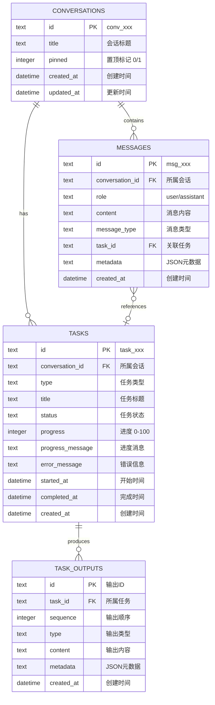

# Openclaw Dashboard - 数据模型设计

*版本：1.0 | 状态：已确认 | 项目类型：已有项目*

---

## 1. 模型概述

### 1.1 项目数据库背景

| 项目信息     | 描述                          |
| ------------ | ----------------------------- |
| 数据库类型   | SQLite (sql.js)               |
| 存储位置     | ./data/dashboard.db           |
| ORM/驱动     | sql.js (纯 JavaScript 实现)   |
| 现有实体数量 | 4 个核心实体                  |

### 1.2 实体变更总览

| 实体名称 | 类型 | 说明 |
|----------|------|------|
| conversations | 📦 现有 | 会话表，已实现 |
| messages | 📦 现有 | 消息表，已实现 |
| tasks | 📦 现有 | 任务表，已实现 |
| task_outputs | 📦 现有 | 任务输出表，已实现 |

> 本项目为已有项目，数据模型已完整实现，本文档为现有模型的规范化描述。

### 1.3 核心实体关系

```
Conversations (会话)
    │
    ├── 1:N ── Messages (消息)
    │
    └── 1:N ── Tasks (任务)
                  │
                  └── 1:N ── TaskOutputs (任务输出)
```

---

## 2. 实体关系图



---

## 3. 实体详细定义

### 3.1 Conversations (会话)

**用途**：存储用户的聊天会话

| 字段名 | 类型 | 约束 | 默认值 | 说明 |
|--------|------|------|--------|------|
| id | TEXT | PK | - | 会话 ID，格式 `conv_xxx` |
| title | TEXT | - | NULL | 会话标题 |
| pinned | INTEGER | - | 0 | 是否置顶 (0: 否, 1: 是) |
| created_at | DATETIME | - | CURRENT_TIMESTAMP | 创建时间 |
| updated_at | DATETIME | - | CURRENT_TIMESTAMP | 更新时间 |

**索引**：无（主键索引）

**关系**：
- `1:N` → Messages
- `1:N` → Tasks

**ID 格式规则**：`conv_` + 12位随机字符，例：`conv_a1b2c3d4e5f6`

---

### 3.2 Messages (消息)

**用途**：存储会话中的所有消息

| 字段名 | 类型 | 约束 | 默认值 | 说明 |
|--------|------|------|--------|------|
| id | TEXT | PK | - | 消息 ID，格式 `msg_xxx` |
| conversation_id | TEXT | FK, NOT NULL | - | 所属会话 ID |
| role | TEXT | NOT NULL | - | 角色：`user` / `assistant` |
| content | TEXT | NOT NULL | - | 消息内容 |
| message_type | TEXT | - | `text` | 消息类型 |
| task_id | TEXT | FK | NULL | 关联的任务 ID |
| metadata | TEXT | - | NULL | JSON 格式元数据 |
| created_at | DATETIME | - | CURRENT_TIMESTAMP | 创建时间 |

**索引**：
- `idx_messages_conversation` ON (conversation_id)
- `idx_messages_task` ON (task_id)

**关系**：
- `N:1` → Conversations
- `N:1` → Tasks (可选)

**枚举值**：

| 字段 | 值 | 说明 |
|------|-----|------|
| role | `user` | 用户消息 |
| role | `assistant` | Agent 响应 |
| message_type | `text` | 普通文本消息 |
| message_type | `task_start` | 任务开始 |
| message_type | `task_update` | 任务更新 |
| message_type | `task_end` | 任务结束 |

---

### 3.3 Tasks (任务)

**用途**：存储 Agent 执行的任务信息

| 字段名 | 类型 | 约束 | 默认值 | 说明 |
|--------|------|------|--------|------|
| id | TEXT | PK | - | 任务 ID，格式 `task_xxx` |
| conversation_id | TEXT | FK, NOT NULL | - | 所属会话 ID |
| type | TEXT | NOT NULL | - | 任务类型 |
| title | TEXT | - | NULL | 任务标题 |
| status | TEXT | - | `pending` | 任务状态 |
| progress | INTEGER | - | 0 | 进度 (0-100) |
| progress_message | TEXT | - | NULL | 当前进度消息 |
| error_message | TEXT | - | NULL | 错误信息（失败时） |
| started_at | DATETIME | - | NULL | 开始时间 |
| completed_at | DATETIME | - | NULL | 完成时间 |
| created_at | DATETIME | - | CURRENT_TIMESTAMP | 创建时间 |

**索引**：
- `idx_tasks_conversation` ON (conversation_id)
- `idx_tasks_status` ON (status)

**关系**：
- `N:1` → Conversations
- `1:N` → TaskOutputs
- `1:N` → Messages

**枚举值**：

| 字段 | 值 | 说明 |
|------|-----|------|
| type | `research` | 搜索/调研任务 |
| type | `code` | 代码生成/修改 |
| type | `file` | 文件处理 |
| type | `command` | 命令执行 |
| type | `custom` | 自定义任务 |
| status | `pending` | 等待中 |
| status | `running` | 运行中 |
| status | `completed` | 已完成 |
| status | `failed` | 失败 |
| status | `cancelled` | 已取消 |

---

### 3.4 TaskOutputs (任务输出)

**用途**：存储任务的详细输出内容

| 字段名 | 类型 | 约束 | 默认值 | 说明 |
|--------|------|------|--------|------|
| id | TEXT | PK | - | 输出 ID |
| task_id | TEXT | FK, NOT NULL | - | 所属任务 ID |
| sequence | INTEGER | - | 0 | 输出顺序 |
| type | TEXT | NOT NULL | - | 输出类型 |
| content | TEXT | - | NULL | 输出内容 |
| metadata | TEXT | - | NULL | JSON 元数据 |
| created_at | DATETIME | - | CURRENT_TIMESTAMP | 创建时间 |

**索引**：
- `idx_task_outputs_task` ON (task_id)

**关系**：
- `N:1` → Tasks

**枚举值**：

| 字段 | 值 | 说明 |
|------|-----|------|
| type | `text` | 文本输出 |
| type | `code` | 代码输出 |
| type | `image` | 图片输出 |
| type | `file` | 文件输出 |
| type | `link` | 链接输出 |

---

## 4. 枚举定义

### 4.1 MessageRole

```typescript
type MessageRole = 'user' | 'assistant';
```

### 4.2 MessageType

```typescript
type MessageType = 'text' | 'task_start' | 'task_update' | 'task_end';
```

### 4.3 TaskType

```typescript
type TaskType = 'research' | 'code' | 'file' | 'command' | 'custom';
```

### 4.4 TaskStatus

```typescript
type TaskStatus = 'pending' | 'running' | 'completed' | 'failed' | 'cancelled';
```

### 4.5 TaskOutputType

```typescript
type TaskOutputType = 'text' | 'code' | 'image' | 'file' | 'link';
```

---

## 5. 字段类型速查

| SQLite 类型 | 对应 TypeScript | 说明 |
|-------------|-----------------|------|
| TEXT | string | 字符串 |
| INTEGER | number | 整数 |
| DATETIME | string / Date | 日期时间（ISO 8601 格式） |
| NULL | null / undefined | 可空值 |

---

## 6. TypeScript 类型定义

```typescript
// 会话
interface Conversation {
  id: string;                    // 格式: conv_xxx
  title?: string | null;
  pinned: boolean;
  createdAt: Date;
  updatedAt: Date;
}

// 消息
interface Message {
  id: string;                    // 格式: msg_xxx
  conversationId: string;
  role: MessageRole;
  content: string;
  messageType: MessageType;
  taskId?: string | null;
  metadata?: Record<string, unknown> | null;
  createdAt: Date;
}

// 任务
interface Task {
  id: string;                    // 格式: task_xxx
  conversationId: string;
  type: TaskType;
  title?: string | null;
  status: TaskStatus;
  progress: number;              // 0-100
  progressMessage?: string | null;
  errorMessage?: string | null;
  startedAt?: Date | null;
  completedAt?: Date | null;
  createdAt: Date;
}

// 任务输出
interface TaskOutput {
  id: string;
  taskId: string;
  sequence: number;
  type: TaskOutputType;
  content?: string | null;
  metadata?: Record<string, unknown> | null;
  createdAt: Date;
}
```

---

## 7. 数据库迁移

### 7.1 现有迁移

| 迁移 | 描述 | 状态 |
|------|------|------|
| Migration 1 | 添加 `pinned` 字段到 conversations 表 | ✅ 已应用 |

### 7.2 迁移代码

```typescript
// apps/server/src/db/index.ts
function runMigrations(database: SqlJsDatabase): void {
  // Migration 1: Add pinned column
  const columns = database.exec("PRAGMA table_info(conversations)");
  const columnNames = columns[0]?.values?.map((v) => v[1] as string) || [];

  if (!columnNames.includes('pinned')) {
    database.run("ALTER TABLE conversations ADD COLUMN pinned INTEGER DEFAULT 0");
  }
}
```

---

## 更新记录

| 日期 | 版本 | 变更内容 |
|------|------|----------|
| 2026-03-11 | 1.0 | 初始化数据模型文档，基于现有 schema.sql 生成 |
