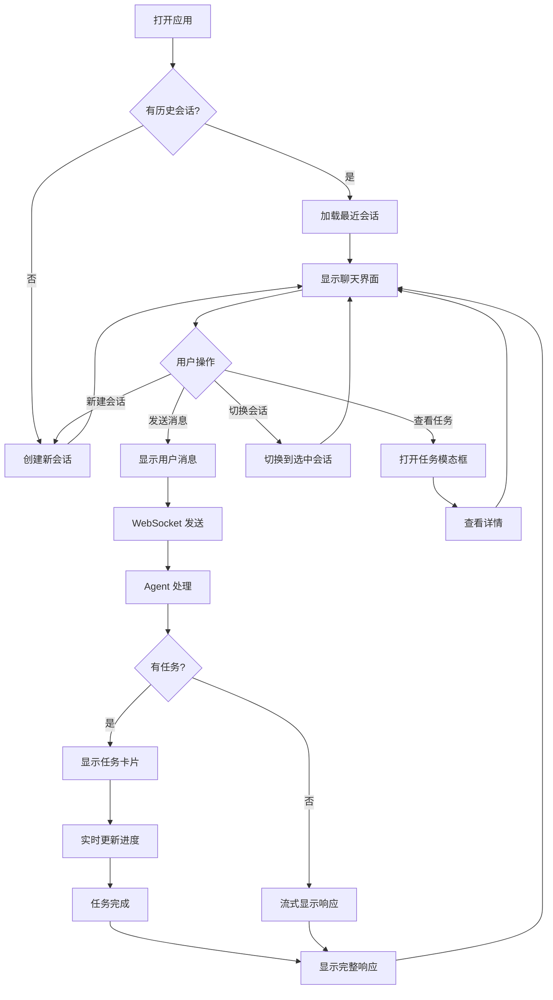

# Openclaw Dashboard - 用户体验设计

*版本：1.0 | 状态：已确认 | 项目类型：已有项目*

---

## 1. 设计概述

### 1.1 设计目标

- **即时响应**：用户操作后 100ms 内反馈，流式响应实时显示
- **简洁高效**：类 ChatGPT 界面，学习成本低
- **信息清晰**：任务状态一目了然，进度实时可见

### 1.2 设计原则

| 原则 | 说明 |
|------|------|
| **Dark Mode First** | 以深色为主题，护眼且现代 |
| **速度优先** | 乐观更新，无需等待确认 |
| **渐进披露** | 核心信息外显，详情按需展开 |
| **一致性** | 组件、交互、颜色全局统一 |

### 1.3 目标用户

| 用户类型 | 特点 | 核心诉求 |
|----------|------|----------|
| 个人开发者 | 技术背景，熟悉 Web 应用 | 快速访问 Agent，高效对话 |
| AI 爱好者 | 探索性强，关注细节 | 了解 Agent 执行过程 |

---

## 2. 信息架构

### 2.1 页面层级

```
主页面 (/)
├── Sidebar (左侧)
│   ├── 品牌标识
│   ├── 新建对话按钮
│   ├── 会话列表
│   │   ├── 置顶区
│   │   └── 普通区
│   └── 连接状态
│
└── MainContent (右侧)
    ├── ChatHeader (会话标题)
    ├── ChatPanel (聊天面板)
    │   ├── MessageList (消息列表)
    │   │   ├── MessageItem (普通消息)
    │   │   ├── TaskCard (任务卡片)
    │   │   └── DateDivider (日期分隔)
    │   └── StreamingMessage (流式响应)
    └── InputBar (输入区)
        ├── 文本输入框
        └── 发送按钮

TaskModal (全局模态框)
├── 任务详情
├── 任务输出
└── 操作按钮
```

### 2.2 导航结构

```
┌──────────────────────────────────────────────────────────────────┐
│                         导航逻辑                                  │
├──────────────────────────────────────────────────────────────────┤
│                                                                  │
│  [新建对话] ─────────────────────────> 创建空白会话              │
│                                                                  │
│  [点击会话] ─────────────────────────> 切换到该会话              │
│       │                                                          │
│       ├── [置顶/取消置顶] ────────────> 更新置顶状态             │
│       ├── [重命名] ──────────────────> 进入编辑模式              │
│       └── [删除] ────────────────────> 删除会话                  │
│                                                                  │
│  [点击任务卡片] ─────────────────────> 打开任务详情模态框        │
│                                                                  │
└──────────────────────────────────────────────────────────────────┘
```

---

## 3. 用户流程

### 3.1 核心流程图



### 3.2 会话管理流程

| 步骤 | 操作 | 系统反馈 |
|------|------|----------|
| 1 | 点击"新对话" | 立即创建会话，切换到新会话 |
| 2 | 点击会话项 | 立即切换，加载历史消息 |
| 3 | 点击置顶 | 立即更新，会话移动到置顶区 |
| 4 | 点击重命名 | 进入编辑模式，显示输入框 |
| 5 | 点击删除 | 立即删除，切换到相邻会话 |

### 3.3 聊天交互流程

| 步骤 | 操作 | 系统反馈 |
|------|------|----------|
| 1 | 输入消息 | 输入框自适应高度 |
| 2 | 点击发送/Enter | 立即显示用户消息（乐观更新） |
| 3 | Agent 响应 | 流式显示响应内容 |
| 4 | 任务开始 | 显示任务卡片，开始进度动画 |
| 5 | 任务进行中 | 实时更新进度条和消息 |
| 6 | 任务完成 | 更新状态图标，停止动画 |

---

## 4. 页面设计

### 4.1 主页面布局

```
┌─────────────────────────────────────────────────────────────────────────┐
│                              主页面                                      │
├────────────────────┬────────────────────────────────────────────────────┤
│                    │                                                    │
│    Sidebar         │    ChatHeader                                      │
│  ┌──────────────┐  │    ┌────────────────────────────────────────────┐  │
│  │ Openclaw  ⚙️ │  │    │ 会话标题                         [关闭侧栏] │  │
│  ├──────────────┤  │    └────────────────────────────────────────────┘  │
│  │              │  │                                                    │
│  │ [+ 新对话]   │  │    MessageList                                     │
│  │              │  │    ┌────────────────────────────────────────────┐  │
│  │ ──────────   │  │    │                                            │  │
│  │ 置顶         │  │    │ [User] 你好，帮我分析一下...               │  │
│  │ 📌 会话 1    │  │    │        今天 10:30                          │  │
│  │              │  │    ├────────────────────────────────────────────┤  │
│  │ ──────────   │  │    │                                            │  │
│  │ 对话         │  │    │ [Agent] 好的，我来帮你分析...              │  │
│  │ 💬 会话 2    │  │    │        今天 10:31                          │  │
│  │ 💬 会话 3    │  │    │                                            │  │
│  │              │  │    ├────────────────────────────────────────────┤  │
│  │              │  │    │ ┌────────────────────────────────────────┐ │  │
│  │              │  │    │ │ 🔬 Research: 分析项目结构              │ │  │
│  │              │  │    │ │ ████████████████░░░░  80%             │ │  │
│  │              │  │    │ │ 📝 正在整理中...                       │ │  │
│  │              │  │    │ │ 状态: 运行中 · 2 分钟前                 │ │  │
│  │              │  │    │ └────────────────────────────────────────┘ │  │
│  │              │  │    └────────────────────────────────────────────┘  │
│  │              │  │                                                    │
│  ├──────────────┤  │    ┌────────────────────────────────────────────┐  │
│  │ 🟢 已连接    │  │    │ InputBar                                   │  │
│  └──────────────┘  │    │ [输入消息...                         ] [➤] │  │
│                    │    └────────────────────────────────────────────┘  │
│  264px (w-64)      │    calc(100% - 264px)                              │
└────────────────────┴────────────────────────────────────────────────────┘
```

### 4.2 组件状态设计

#### Sidebar

| 状态 | 显示 |
|------|------|
| **空状态** | 暂无对话 + 图标 |
| **正常** | 会话列表，置顶在前 |
| **加载中** | Loading 动画 |
| **断开连接** | 红点 + "未连接" |

#### MessageItem

| 状态 | 显示 |
|------|------|
| **用户消息** | 右对齐，无头像 |
| **Agent 消息** | 左对齐，无头像 |
| **发送中** | 灰色圆点 |
| **发送成功** | 无标记 |
| **发送失败** | 红色感叹号 + 重试按钮 |

#### TaskCard

| 状态 | 显示 |
|------|------|
| **pending** | 黄色图标，进度 0%，时间图标 |
| **running** | 蓝色图标，进度条动画，旋转加载图标 |
| **completed** | 绿色图标，进度 100%，勾选图标 |
| **failed** | 红色图标，错误消息，叉号图标 |
| **cancelled** | 灰色图标，进度冻结 |

#### InputBar

| 状态 | 显示 |
|------|------|
| **空** | 灰色占位符 "输入消息..." |
| **输入中** | 白色文本，自适应高度 |
| **发送中** | 输入框禁用，发送按钮旋转 |
| **断开连接** | 输入框禁用，提示 "未连接" |

### 4.3 任务模态框 (TaskModal)

```
┌─────────────────────────────────────────────────────────────────────────┐
│ ×  🔬 Research: 分析项目结构                                    [取消]  │
├─────────────────────────────────────────────────────────────────────────┤
│                                                                         │
│ 状态: ✅ 已完成 · 耗时 3 分 20 秒                                        │
│                                                                         │
│ ┌─────────────────────────────────────────────────────────────────────┐ │
│ │ 输出内容                                                             │ │
│ │                                                                     │ │
│ │ ## 1. 项目结构概述                                                   │ │
│ │                                                                     │ │
│ │ 该项目采用 Monorepo 结构，使用 pnpm workspace 管理...               │ │
│ │                                                                     │ │
│ │ ## 2. 核心模块                                                       │ │
│ │                                                                     │ │
│ │ - apps/web: 前端应用 (Next.js 14)                                   │ │
│ │ - apps/server: 后端应用 (Fastify)                                   │ │
│ │ - packages/shared: 共享类型                                         │ │
│ │                                                                     │ │
│ └─────────────────────────────────────────────────────────────────────┘ │
│                                                                         │
│ ─────────────────────────────────────────────────────────────────────── │
│ [复制全部] [导出为 Markdown]                                            │
└─────────────────────────────────────────────────────────────────────────┘
```

---

## 5. 组件规范

### 5.1 按钮组件

| 类型 | 样式 | 使用场景 |
|------|------|----------|
| **主要按钮** | `bg-primary-600 hover:bg-primary-700` | 新对话、发送 |
| **次要按钮** | `bg-neutral-700 hover:bg-neutral-600` | 取消、关闭 |
| **幽灵按钮** | `hover:bg-neutral-700` | 图标按钮、操作按钮 |
| **危险按钮** | `text-red-500 hover:bg-red-500/10` | 删除 |

### 5.2 表单组件

| 组件 | 样式 |
|------|------|
| **输入框** | `bg-neutral-800 border-neutral-700 focus:border-primary-500` |
| **文本域** | 自适应高度，最小 1 行，最大 5 行 |
| **焦点状态** | `ring-2 ring-primary-500` |

### 5.3 反馈组件

| 组件 | 样式 | 使用场景 |
|------|------|----------|
| **加载中** | `animate-spin` | 任务运行、发送中 |
| **成功** | `text-green-500` | 任务完成 |
| **错误** | `text-red-500` | 任务失败、发送失败 |
| **警告** | `text-yellow-500` | 任务等待 |

---

## 6. 响应式设计

### 6.1 断点定义

| 断点 | 宽度 | 布局 |
|------|------|------|
| **Mobile** | < 768px | Sidebar 覆盖，点击外部关闭 |
| **Tablet** | 768px - 1024px | Sidebar 固定，宽度 256px |
| **Desktop** | > 1024px | Sidebar 固定，宽度 256px |

### 6.2 移动端适配

| 组件 | 移动端变化 |
|------|------------|
| **Sidebar** | 固定覆盖，点击外部关闭 |
| **Menu 按钮** | 左上角显示汉堡菜单 |
| **InputBar** | 全宽，固定底部 |
| **TaskModal** | 全屏宽度 |

### 6.3 布局策略

```css
/* Desktop/Tablet */
.sidebar {
  width: 256px; /* w-64 */
  position: relative;
}

/* Mobile */
@media (max-width: 768px) {
  .sidebar {
    position: fixed;
    width: 288px; /* w-72 */
    z-index: 40;
  }

  .sidebar-overlay {
    position: fixed;
    inset: 0;
    background: rgba(0, 0, 0, 0.5);
    z-index: 30;
  }
}
```

---

## 7. 设计系统

### 7.1 颜色系统

| 语义 | 变量 | 值 | 用途 |
|------|------|-----|------|
| **背景** | bg-neutral-900 | #171717 | 页面背景 |
| **卡片** | bg-neutral-800 | #262626 | 侧边栏、卡片 |
| **边框** | border-neutral-700 | #404040 | 分割线、边框 |
| **主色** | bg-primary-600 | #0284c7 | 主要按钮 |
| **主色悬停** | bg-primary-700 | #0369a1 | 按钮悬停 |
| **成功** | text-green-500 | #22c55e | 成功状态 |
| **警告** | text-yellow-500 | #eab308 | 警告状态 |
| **错误** | text-red-500 | #ef4444 | 错误状态 |
| **信息** | text-blue-500 | #3b82f6 | 信息状态 |

### 7.2 字体系统

| 层级 | 样式 | 使用场景 |
|------|------|----------|
| **H1** | text-lg font-semibold | 品牌名 |
| **H2** | text-base font-medium | 会话标题 |
| **H3** | text-sm font-medium | 任务标题 |
| **Body** | text-sm | 消息内容 |
| **Caption** | text-xs text-neutral-500 | 时间、状态 |

### 7.3 间距系统

| 名称 | 值 | 使用场景 |
|------|-----|----------|
| **xs** | 4px (gap-1) | 图标与文字 |
| **sm** | 8px (gap-2) | 按钮内间距 |
| **md** | 16px (gap-4/p-4) | 组件内间距 |
| **lg** | 24px (gap-6/p-6) | 区块间距 |

### 7.4 圆角系统

| 名称 | 值 | 使用场景 |
|------|-----|----------|
| **sm** | 4px (rounded) | 小组件 |
| **md** | 8px (rounded-lg) | 卡片、按钮 |
| **full** | 9999px (rounded-full) | 状态点、头像 |

---

## 8. 交互规范

### 8.1 动画规范

| 场景 | 动画 | 时长 |
|------|------|------|
| **悬停** | transition-colors | 150ms |
| **任务进度** | transition-all | 300ms |
| **加载** | animate-spin | 1s linear infinite |
| **模态框** | fade in + scale | 200ms |

### 8.2 键盘操作

| 按键 | 行为 |
|------|------|
| **Enter** | 发送消息（输入框内） |
| **Shift + Enter** | 换行（输入框内） |
| **Escape** | 关闭模态框、取消编辑 |
| **Tab** | 焦点切换 |

### 8.3 无障碍

| 要求 | 实现 |
|------|------|
| **焦点可见** | focus:ring-2 focus:ring-primary-500 |
| **按钮尺寸** | min-w-[44px] min-h-[44px]（移动端） |
| **ARIA 标签** | aria-label 描述操作 |
| **语义化** | 使用 role、tabIndex |

---

## 更新记录

| 日期 | 版本 | 变更内容 |
|------|------|----------|
| 2026-03-11 | 1.0 | 初始化 UX 设计文档，基于现有组件和 PRD 生成 |
