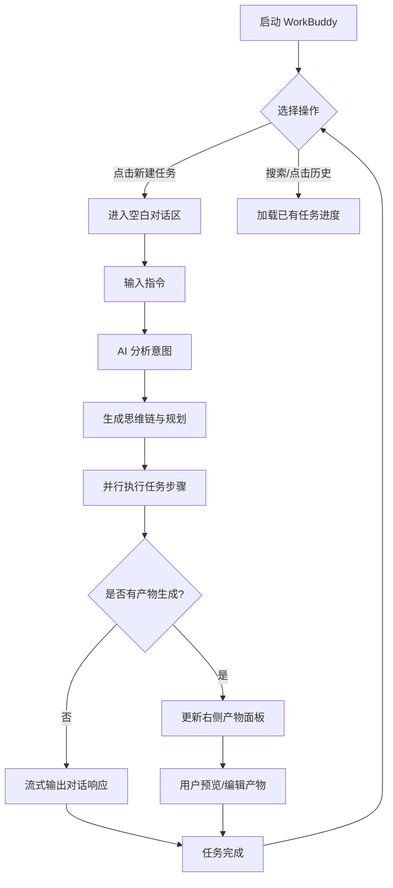

# WorkBuddy AI 智能体工作台 - 用户体验设计

*版本：1.0 | 状态：已确认 | 项目类型：AI 智能体桌面应用*

---

## 1. 设计概述

### 1.1 设计目标

- **高效执行**：用户输入指令后，AI 立即开始任务规划与执行，反馈时间控制在 100ms 内。
- **全景工作台**：集成侧边导航、聊天对话与右侧产物面板，提供一站式生产力工具。
- **结果导向**：不仅提供对话响应，重点在于生成可交付的产物（文档、代码、图表）。

### 1.2 设计原则

| 原则 | 说明 |
|------|------|
| **Minimal. Fast. Reliable.** | 极简界面，快速响应，可靠的执行结果 |
| **三栏式布局** | 导航、交互、产物三位一体，信息流动自然 |
| **沉浸式黑暗模式** | 以 #171717 为基色，适配长时间办公需求 |
| **思维链透明化** | 展示 AI 执行任务的具体步骤，建立用户信任感 |

### 1.3 目标用户

| 用户类型 | 特点 | 核心诉求 |
|----------|------|----------|
| 开发者/工程师 | 追求效率，习惯多窗口并行 | 快速生成代码、文档及自动化脚本 |
| 职场专业人士 | 任务复杂，需要产出高质量报告 | 复杂任务拆解与高质量产物生成 |

---

## 2. 信息架构

### 2.1 页面层级

```
WorkBuddy 应用 (/)
├── Sidebar (左侧导航)
│   ├── 全局搜索 (搜索任务)
│   ├── [+ 新建任务]
│   ├── 核心功能区 (Claw, 专家, 技能, 插件, 自动化)
│   ├── 任务历史 (Workspace/Task)
│   └── 用户中心 (个人信息/设置入口)
│
├── MainChat (中间对话区)
│   ├── TaskHeader (任务名称/控制)
│   ├── MessageList (消息流)
│   │   ├── UserMessage (用户指令)
│   │   ├── AgentMessage (Agent 响应)
│   │   └── TaskStatusCard (任务进度/耗时卡片)
│   ├── ExpertCenter (专家中心 - 切换视图)
│   │   ├── CategoryTabs (行业分类页签)
│   │   └── ExpertGrid (专家卡片网格)
│   ├── AutomationCenter (自动化中心 - 切换视图)
│   │   ├── AutomationHeader (标题与操作按钮)
│   │   └── ScheduledTasksList (已安排任务列表)
│   └── InputBar (输入区)
│
└── ArtifactsPanel (右侧产物区 - 可折叠)
    ├── TabNavigation (产物/全部文件/变更/预览)
    ├── ArtifactList (产物列表)
    └── ContentPreview (详情预览/Markdown 渲染)
```

### 2.2 导航结构

```
┌──────────────────────────────────────────────────────────────────┐
│                         导航逻辑                                  │
├──────────────────────────────────────────────────────────────────┤
│                                                                  │
│  [新建任务] ─────────────────────────> 创建空白任务空间          │
│                                                                  │
│  [点击历史项] ───────────────────────> 切换到该任务历史          │
│                                                                  │
│  [点击功能/技能] ─────────────────────> 调起特定 AI 工具          │
│                                                                  │
│  [发送消息] ─────────────────────────> 触发 AI 规划与执行         │
│                                                                  │
│  [点击产物链接/标签] ─────────────────> 展开右侧面板并定位产物    │
│                                                                  │
└──────────────────────────────────────────────────────────────────┘
```

---

## 3. 用户流程

### 3.1 核心流程图



### 3.2 任务管理流程

| 步骤 | 操作 | 系统反馈 |
|------|------|----------|
| 1 | 点击“新建任务” | 清空当前对话，聚焦输入框，侧栏新增历史项 |
| 2 | 输入“搜索任务” | 实时过滤侧边栏历史列表 |
| 3 | 切换功能模块 | 调整 AI 偏好模型，如：进入“专家”模式 |
| 4 | 关闭/展开产物区 | 重新分配中间对话区的宽度布局 |

### 3.3 专家召唤流程

| 步骤 | 操作 | 系统反馈 |
|------|------|----------|
| 1 | 点击侧栏“专家” | 中间对话区切换为“专家中心”视图 |
| 2 | 切换行业分类标签 | 实时筛选并更新专家卡片列表 |
| 3 | 悬停在专家卡片上 | 显示“+ 立即召唤”按钮 |
| 4 | 点击“立即召唤” | 自动切换回对话视图，并由该专家发起首条消息或等待用户指令 |

### 3.4 自动化管理流程

| 步骤 | 操作 | 系统反馈 |
|------|------|----------|
| 1 | 点击侧栏“自动化” | 中间对话区切换为“自动化”管理视图 |
| 2 | 点击“+ 添加” | 打开新建自动化任务弹窗/页面 |
| 3 | 点击“从模版添加” | 展示预设的自动化方案列表 |
| 4 | 查看已安排任务 | 列表展示任务名称、执行 Agent、预定时间及倒计时 |

---

## 4. 页面设计

### 4.1 主页面布局 (页面设计图)

```
┌──────────────────────────────────────────────────────────────────────────────────────────┐
│                                       WorkBuddy 工作台                                     │
├────────────────────┬──────────────────────────────────────┬──────────────────────────────┤
│      SIDEBAR       │              MAIN CHAT               │      ARTIFACTS PANEL         │
├────────────────────┤   ┌──────────────────────────────┐   ├──────────────────────────────┤
│ 🔍 搜索任务        │   │ 帮我生成workbuddy ux文档...   │   │ [产物] [全部文件] [变更] [预览] │
├────────────────────┤   │             (48 分钟前)       │   ├──────────────────────────────┤
│ [+ 新建任务]       │   └──────────────────────────────┘   │                              │
├────────────────────┤                                      │ 产物                          │
│ 🤖 Claw            │   ┌──────────────────────────────┐   │ 📄 workbuddy-ux-design       │
│ 👤 专家            │   │ [Agent] 我来帮你生成文档...   │   │ 📄 workbuddy-ux-wireframes   │
│ ⚡ 技能            │   │                              │   │                              │
│ 🔌 插件            │   │ ┌──────────────────────────┐ │   ├──────────────────────────────┤
│ ⚙️  自动化          │   │ │ ⚙️  执行中 (计时 02:30)    │ │   │ WorkBuddy UX 设计文档        │
│                    │   │ │ ██████████░░░░ 75%       │ │   │                              │
├────────────────────┤   │ │ 正在生成 UX 文档正文...    │ │   │ 一、产品概述                  │
│ 任务               │   │ └──────────────────────────┘ │   │ 1.1 产品定位...              │
│ ⚙️ 帮我生成workbu..│   │                              │   │                              │
│ ✅ workbuddy与cla..│   └──────────────────────────────┘   │                              │
├────────────────────┤                                      │                              │
│ 工作空间           │   ┌──────────────────────────────┐   │                              │
│ 📁 Claw            │   │ [输入消息...           ] [➤] │   │                              │
│ ✅ 你好            │   └──────────────────────────────┘   │                              │
├────────────────────┤                                      │                              │
│ 👨‍💻 翁俊 (个人中心)  │   25% (Sidebar) + 40% (Chat) + 35% (Artifacts)                   │
└────────────────────┴──────────────────────────────────────┴──────────────────────────────┘
```

### 4.2 专家中心页面 (Expert Center)

当点击侧边栏“专家”时，中间对话区切换为以下展示：

```
┌──────────────────────────────────────────────────────────────────────────────────────────┐
│                                       专家中心                                           │
├──────────────────────────────────────────────────────────────────────────────────────────┤
│  专家中心                                                                                │
│  按行业分类浏览专家，召唤他们为你服务                                                    │
│                                                                                          │
│  [全部] [设计 (8)] [工程技术 (21)] [市场营销 (26)] [付费媒体 (7)] [销售 (8)] ...         │
├──────────────────────────────────────────────────────────────────────────────────────────┤
│                                                                                          │
│  ┌──────────────────┐  ┌──────────────────┐  ┌──────────────────┐  ┌──────────────────┐  │
│  │      (Avatar)    │  │      (Avatar)    │  │      (Avatar)    │  │      (Avatar)    │  │
│  │        Kai       │  │      Phoebe      │  │        Jude      │  │        Maya      │  │
│  │    内容创作专家  │  │   数据分析报告师 │  │ 中国电商运营专家 │  │     抖音策略师   │  │
│  │ 擅长创作引人入.. │  │ 将复杂数据转化.. │  │ 精通天猫京东..   │  │ 精通抖音算法..   │  │
│  │                  │  │   [+ 立即召唤]   │  │                  │  │                  │  │
│  └──────────────────┘  └──────────────────┘  └──────────────────┘  └──────────────────┘  │
│                                                                                          │
│  ┌──────────────────┐  ┌──────────────────┐  ┌──────────────────┐  ┌──────────────────┐  │
│  │      (Avatar)    │  │      (Avatar)    │  │      (Avatar)    │  │      (Avatar)    │  │
│  │        Ula       │  │        Ben       │  │        Fay       │  │        Tess      │  │
│  │      销售教练    │  │     品牌策略师   │  │   小红书运营专家 │  │       招聘专家   │  │
│  └──────────────────┘  └──────────────────┘  └──────────────────┘  └──────────────────┘  │
│                                                                                          │
└──────────────────────────────────────────────────────────────────────────────────────────┘
```

### 4.3 自动化管理页面 (Automation)

当点击侧边栏“自动化”时，中间对话区切换为以下展示：

```
┌──────────────────────────────────────────────────────────────────────────────────────────┐
│                                        自动化 Beta                                       │
├──────────────────────────────────────────────────────────────────────┬──────────────────┤
│ 管理自动化任务并查看近期运行记录。                                   │ [+ 添加] [从模版添加] │
├──────────────────────────────────────────────────────────────────────┴──────────────────┤
│                                                                                          │
│ 已安排                                                                                   │
│                                                                                          │
│ ┌──────────────────────────────────────────────────────────────────────────────────────┐ │
│ │ ○ 每周工作周报  [Claw] [周五 · 17:00]                                     2天后开始  │ │
│ └──────────────────────────────────────────────────────────────────────────────────────┘ │
│                                                                                          │
└──────────────────────────────────────────────────────────────────────────────────────────┘
```

### 4.4 组件状态设计

#### Sidebar (侧边栏)

| 状态 | 显示内容 |
|------|----------|
| **默认** | 展示核心功能区、分类标题、任务历史 |
| **搜索中** | 历史列表实时匹配关键字，不匹配项置灰或隐藏 |
| **运行中** | 对应的历史任务项旁出现“呼吸灯”图标 |

#### TaskStatusCard (任务卡片)

| 状态 | 样式 |
|------|------|
| **pending** | 灰色闪烁图标，提示“等待中” |
| **running** | 蓝色/绿色旋转图标，显示进度条与当前具体子任务 |
| **completed** | 绿色对勾，显示总耗时与“已完成” |
| **failed** | 红色警告，提供错误重试按钮 |

#### ArtifactsPanel (产物面板)

| 状态 | 显示内容 |
|------|----------|
| **空状态** | 提示“尚无产物生成，请下达任务指令” |
| **预览模式** | 渲染后的 Markdown、PDF、图表预览 |
| **编辑模式** | 文本/代码编辑器界面 (Monaco Editor) |
| **对比模式** | 左右展示变更差异 (Diff View) |

#### ExpertCard (专家卡片)

| 状态 | 显示内容 |
|------|----------|
| **默认** | 展示专家头像、姓名、头衔、简介 |
| **悬停 (Hover)** | 姓名及头衔变色，在卡片中央浮现紫色背景的“[+ 立即召唤]”按钮 |
| **已选中/召唤** | 卡片出现紫色外边框或光晕效果 |

#### AutomationTaskItem (自动化任务项)

| 状态 | 显示内容 |
|------|----------|
| **默认** | 展示任务状态圆圈、任务名称、执行 Agent 标签、预定时间标签、倒计时 |
| **已安排** | 圆圈展示为待执行边框，展示相对时间（如：2天后开始） |
| **已激活** | 圆圈填充，展示任务当前活跃状态 |
| **Beta 标签** | 在标题旁显示“Beta”小字，采用灰色背景或浅色文字 |

---

## 5. 组件规范

### 5.1 颜色系统

| 语义 | 变量 | 值 | 用途 |
|------|------|-----|------|
| **背景** | bg-neutral-900 | #171717 | 应用主背景 |
| **侧边/卡片** | bg-neutral-800 | #262626 | 导航栏、浮窗、卡片 |
| **边框** | border-neutral-700 | #404040 | 布局分割线 |
| **主色 (Sky)** | bg-sky-500 | #0ea5e9 | 新建按钮、主交互按钮 |
| **成功 (Success)** | text-green-500 | #22c55e | 执行完成、成功状态 |

### 5.2 字体与图标

- **字体**: System UI, Inter, font-mono (用于代码/产物详情)
- **图标库**: Lucide-React (18px 用于侧栏, 16px 用于内联)

---

## 6. 响应式设计

- **桌面端 (>1280px)**：满载三栏布局，产物面板常驻。
- **笔记本 (1024px - 1280px)**：产物面板默认收起，点击时浮动显示或挤压对话区。
- **移动端 (<768px)**：侧栏隐藏，主界面仅保留对话区，产物通过全屏模态框查看。

---

## 更新记录

| 日期 | 版本 | 变更内容 |
| :--- | :--- | :--- |
| 2026-03-18 | 1.0 | 参考 04_UX_DESIGN.md 格式完全重构 WorkBuddy UX 文档 |
| 2026-03-18 | 1.1 | 补充“专家中心”视图及专家卡片组件设计 |
| 2026-03-18 | 1.2 | 补充“自动化”管理视图及自动化任务项组件设计 |
| 2026-03-18 | 1.3 | 修正主页面布局，完善侧边栏“任务”与“工作空间”层级 |
