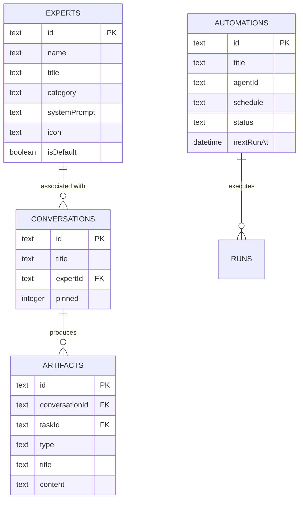

# WorkBuddy 功能融合设计文档

*版本：1.0 | 状态：已确认 | 日期：2026-03-18*

---

## 1. 概述

### 1.1 背景

将 WorkBuddy AI 工作台的核心功能融合到 Openclaw Dashboard 项目中，提升产品能力和用户体验。

### 1.2 融合功能

| 功能 | 描述 | 展示方式 |
|------|------|----------|
| **产物面板 (Artifacts Panel)** | 展示 AI 生成的文档、代码、图表等产物 | 右侧滑出层 |
| **专家中心 (Expert Center)** | 专家卡片网格，支持选择角色进行对话 | 视图切换 |
| **自动化中心 (Automation)** | 定时任务管理，支持创建和查看自动化任务 | 视图切换 |

### 1.3 设计原则

- **渐进式融合**：保留现有组件结构，在 MainContent 层级实现视图切换
- **三栏布局**：Sidebar + MainContent + ArtifactsPanel（可折叠）
- **角色驱动**：聊天时可选择不同专家/角色，影响对话的系统提示词

---

## 2. 信息架构

### 2.1 页面层级

```
Openclaw Dashboard (/)
├── Sidebar (左侧导航 - 扩展)
│   ├── 品牌标识
│   ├── 全局搜索 (新增)
│   ├── [+ 新对话]
│   ├── 核心功能区 (新增)
│   │   ├── 💬 Claw (默认聊天)
│   │   ├── 👤 专家 (专家中心入口)
│   │   └── ⚙️ 自动化 (自动化中心入口)
│   ├── 会话列表
│   │   ├── 置顶区
│   │   └── 普通区
│   └── 连接状态
│
├── MainContent (中间主区域 - 支持视图切换)
│   ├── ChatView (默认 - 现有聊天)
│   │   ├── ChatHeader
│   │   ├── ChatPanel (MessageList + InputBar)
│   │   └── TaskModal (模态框)
│   ├── ExpertCenter (专家中心视图 - 新增)
│   │   ├── CategoryTabs (行业分类页签)
│   │   └── ExpertGrid (专家卡片网格)
│   └── AutomationCenter (自动化中心视图 - 新增)
│       ├── AutomationHeader (标题与操作按钮)
│       └── ScheduledTasksList (已安排任务列表)
│
└── ArtifactsPanel (右侧产物面板 - 可折叠/滑出)
    ├── PanelHeader (关闭按钮)
    ├── TabNavigation (产物/全部文件/变更/预览)
    ├── ArtifactList (产物列表)
    └── ContentPreview (详情预览/Markdown 渲染)
```

### 2.2 布局比例

- Sidebar: 264px (w-64)
- MainContent: 弹性填充
- ArtifactsPanel: 320px-400px (可调节，默认隐藏)

---

## 3. 页面设计

### 3.1 侧边栏 (Sidebar)

```
┌────────────────────────┐
│ Openclaw          ⚙️ × │  ← 品牌标识 + 设置 + 关闭
├────────────────────────┤
│ 🔍 搜索任务...         │  ← 新增：全局搜索框
├────────────────────────┤
│ [+ 新对话]             │  ← 保持现有样式
├────────────────────────┤
│ 💬 Claw                │  ← 新增：默认聊天模式（高亮）
│ 👤 专家                │  ← 新增：专家中心入口
│ ⚙️ 自动化          Beta │  ← 新增：自动化中心入口
├────────────────────────┤
│ 置顶                   │
│ 📌 会话 1              │
├────────────────────────┤
│ 对话                   │
│ 💬 会话 2              │
│ 💬 会话 3              │
│ ...                    │
├────────────────────────┤
│ 🟢 已连接              │  ← 连接状态
└────────────────────────┘
```

**交互行为**：
- 点击 "Claw/专家/自动化" 切换主区域视图
- 当前选中项显示 `bg-primary-600` 高亮
- 搜索框实时过滤会话列表

### 3.2 ChatView（聊天视图）

```
┌─────────────────────────────────────────────────────────┐
│ 会话标题                               [📄 产物] [关闭] │  ← 新增产物按钮
├─────────────────────────────────────────────────────────┤
│                                                         │
│ MessageList                                             │
│ ├── UserMessage                                         │
│ ├── AgentMessage (流式)                                 │
│ └── TaskCard                                            │
│                                                         │
├─────────────────────────────────────────────────────────┤
│ [🤖 Claw ▾] [输入消息...                        ] [➤] │  ← 角色选择器在输入栏左侧
└─────────────────────────────────────────────────────────┘
```

**角色选择器下拉菜单**：

```
┌─────────────────────────────┐
│ 🤖 Claw (默认)       ✓     │
│ ───────────────────────────│
│ 👤 Kai - 内容创作          │
│ 👤 Phoebe - 数据分析       │
│ 👤 Jude - 电商运营         │
│ 👤 Maya - 抖音策略         │
│ ───────────────────────────│
│ 👤 查看全部专家...         │  ← 跳转到 ExpertCenter
└─────────────────────────────┘
```

**交互行为**：
- 输入栏左侧始终显示当前选中的角色图标和名称
- 点击展开下拉菜单快速切换
- 切换后该会话后续消息带上对应角色的 prompt
- 底部 "查看全部专家" 链接跳转到专家中心视图

### 3.3 ExpertCenter（专家中心）

```
┌─────────────────────────────────────────────────────────┐
│ 专家中心                                                │
│ 按行业分类浏览专家，召唤他们为你服务                     │
├─────────────────────────────────────────────────────────┤
│ [全部] [设计 (8)] [工程技术 (21)] [市场营销 (26)] ...   │  ← 分类标签
├─────────────────────────────────────────────────────────┤
│                                                         │
│ ┌──────────┐ ┌──────────┐ ┌──────────┐ ┌──────────┐   │
│ │  (头像)  │ │  (头像)  │ │  (头像)  │ │  (头像)  │   │
│ │   Kai    │ │  Phoebe  │ │   Jude   │ │   Maya   │   │
│ │ 内容专家 │ │ 数据分析 │ │ 电商运营 │ │ 抖音策略 │   │
│ │ [召唤]   │ │ [召唤]   │ │ [召唤]   │ │ [召唤]   │   │
│ └──────────┘ └──────────┘ └──────────┘ └──────────┘   │
│                                                         │
└─────────────────────────────────────────────────────────┘
```

**交互行为**：
- 点击分类标签过滤专家列表
- 悬停显示 "[+ 立即召唤]" 按钮
- 点击 "召唤" 切换到 ChatView 并选中该角色

### 3.4 AutomationCenter（自动化中心）

```
┌─────────────────────────────────────────────────────────┐
│ 自动化                                         Beta     │
│ 管理自动化任务并查看近期运行记录                         │
│                                   [+ 添加] [从模版添加] │
├─────────────────────────────────────────────────────────┤
│ 已安排                                                  │
│                                                         │
│ ○ 每周工作周报  [Claw] [周五 · 17:00]       2天后开始  │
│ ○ 代码审查提醒  [Claw] [周一 · 09:00]       5天后开始  │
│                                                         │
└─────────────────────────────────────────────────────────┘
```

**交互行为**：
- 点击 "+ 添加" 打开新建自动化任务弹窗
- 点击任务项查看详情或编辑
- 显示倒计时和下次执行时间

### 3.5 ArtifactsPanel（产物面板）

```
┌─────────────────────────────────────────────────────────┐
│ × 产物面板                                              │  ← 关闭按钮
├─────────────────────────────────────────────────────────┤
│ [产物] [全部文件] [变更] [预览]                         │  ← Tab 导航
├─────────────────────────────────────────────────────────┤
│                                                         │
│ 产物列表                                                │
│ ┌─────────────────────────────────────────────────────┐ │
│ │ 📄 workbuddy-ux-design.md           今天 14:30     │ │
│ │    一、产品概述...                                  │ │
│ ├─────────────────────────────────────────────────────┤ │
│ │ 📄 api-specification.md             今天 14:25     │ │
│ │    API 接口规范...                                  │ │
│ ├─────────────────────────────────────────────────────┤ │
│ │ 📊 data-analysis-report.pdf         今天 14:20     │ │
│ │    数据分析报告...                                  │ │
│ └─────────────────────────────────────────────────────┘ │
│                                                         │
├─────────────────────────────────────────────────────────┤
│ 预览                                                    │
│ ┌─────────────────────────────────────────────────────┐ │
│ │ # WorkBuddy UX 设计文档                             │ │
│ │                                                     │ │
│ │ ## 1. 产品概述                                      │ │
│ │                                                     │ │
│ │ 本产品定位为 AI 智能体工作台...                     │ │
│ │                                                     │ │
│ └─────────────────────────────────────────────────────┘ │
│ [复制] [下载] [编辑]                                    │
└─────────────────────────────────────────────────────────┘
```

**Tab 说明**：
- **产物**：当前会话生成的产物列表
- **全部文件**：所有会话的文件产物
- **变更**：代码变更差异视图
- **预览**：Markdown/代码预览

**交互行为**：
- 默认隐藏，点击 ChatHeader 的 [📄 产物] 按钮滑出
- 宽度 320px-400px，可拖拽调整
- 点击外部区域或 × 按钮关闭
- 点击产物项在预览区显示内容

---

## 4. 数据模型

### 4.1 新增实体

#### Experts（专家/角色）

```typescript
interface Expert {
  id: string;                    // 格式: expert_xxx
  name: string;                  // 专家名称
  avatar?: string;               // 头像 URL
  title: string;                 // 头衔，如 "内容创作专家"
  description?: string;          // 简介
  category: string;              // 分类，如 "设计"、"工程技术"
  systemPrompt: string;          // 系统提示词
  color?: string;                // 主题色
  icon?: string;                 // 图标
  isDefault?: boolean;           // 是否为默认角色
  createdAt: Date;
  updatedAt: Date;
}
```

#### Automations（自动化任务）

```typescript
interface Automation {
  id: string;                    // 格式: auto_xxx
  title: string;                 // 任务名称
  description?: string;          // 任务描述
  agentId: string;               // 执行的 Agent ID
  schedule: string;              // Cron 表达式
  scheduleDescription: string;   // 人类可读的调度描述
  status: 'active' | 'paused' | 'deleted';
  lastRunAt?: Date;              // 上次执行时间
  nextRunAt?: Date;              // 下次执行时间
  createdAt: Date;
  updatedAt: Date;
}
```

#### Artifacts（产物）

```typescript
interface Artifact {
  id: string;                    // 格式: artifact_xxx
  conversationId: string;        // 所属会话
  taskId?: string;               // 关联任务（可选）
  type: 'document' | 'code' | 'image' | 'file';
  title: string;                 // 产物标题
  content?: string;              // 产物内容
  filePath?: string;             // 文件路径
  mimeType?: string;             // MIME 类型
  metadata?: Record<string, unknown>;
  createdAt: Date;
  updatedAt: Date;
}
```

### 4.2 扩展现有实体

#### Conversations（扩展）

```typescript
interface Conversation {
  // ... 现有字段
  expertId?: string;             // 新增：关联的专家/角色 ID
}
```

### 4.3 实体关系图



---

## 5. 状态管理

### 5.1 Zustand Store 扩展

```typescript
interface AppState {
  // 现有状态...

  // 新增：视图状态
  currentView: 'chat' | 'expert' | 'automation';
  setCurrentView: (view: 'chat' | 'expert' | 'automation') => void;

  // 新增：产物面板状态
  artifactsPanelOpen: boolean;
  toggleArtifactsPanel: () => void;

  // 新增：专家相关状态
  experts: Expert[];
  setExperts: (experts: Expert[]) => void;
  currentExpertId: string | null;
  setCurrentExpert: (id: string) => void;

  // 新增：自动化相关状态
  automations: Automation[];
  setAutomations: (automations: Automation[]) => void;

  // 新增：产物相关状态
  artifacts: Artifact[];
  setArtifacts: (artifacts: Artifact[]) => void;
  selectedArtifactId: string | null;
  setSelectedArtifact: (id: string | null) => void;
}
```

---

## 6. API 设计

### 6.1 Experts API

| 方法 | 路径 | 描述 |
|------|------|------|
| GET | `/api/experts` | 获取专家列表 |
| GET | `/api/experts/:id` | 获取专家详情 |
| POST | `/api/experts` | 创建专家 |
| PUT | `/api/experts/:id` | 更新专家 |
| DELETE | `/api/experts/:id` | 删除专家 |

### 6.2 Automations API

| 方法 | 路径 | 描述 |
|------|------|------|
| GET | `/api/automations` | 获取自动化任务列表 |
| GET | `/api/automations/:id` | 获取任务详情 |
| POST | `/api/automations` | 创建任务 |
| PUT | `/api/automations/:id` | 更新任务 |
| DELETE | `/api/automations/:id` | 删除任务 |
| POST | `/api/automations/:id/run` | 立即执行任务 |

### 6.3 Artifacts API

| 方法 | 路径 | 描述 |
|------|------|------|
| GET | `/api/artifacts?conversationId=xxx` | 获取会话产物列表 |
| GET | `/api/artifacts/:id` | 获取产物详情 |
| POST | `/api/artifacts` | 创建产物 |
| PUT | `/api/artifacts/:id` | 更新产物 |
| DELETE | `/api/artifacts/:id` | 删除产物 |

---

## 7. 实现计划

### 7.1 阶段划分

| 阶段 | 功能 | 主要工作 | 优先级 |
|------|------|----------|--------|
| **Phase 1** | 基础架构重构 | 三栏布局、视图切换框架、状态管理扩展 | P0 |
| **Phase 2** | 产物面板 | ArtifactsPanel 组件、产物数据模型、后端 API | P0 |
| **Phase 3** | 专家中心 | ExpertCenter 视图、角色选择器、Experts 数据模型 | P1 |
| **Phase 4** | 自动化中心 | AutomationCenter 视图、Automations 数据模型、调度服务 | P2 |

### 7.2 Phase 1 详细任务

**前端任务**：
1. 扩展 `chatStore` - 添加 `currentView`、`artifactsPanelOpen` 状态
2. 重构 `MainContent` - 支持视图切换（chat/expert/automation）
3. 新增 `ArtifactsPanel` 容器组件（空状态）
4. 扩展 `Sidebar` - 添加功能入口（Claw/专家/自动化）、搜索框
5. 新增 `InputBar` 角色选择器

**后端任务**：
1. 扩展数据库 schema - 添加 experts、automations、artifacts 表
2. 新增 Experts API（CRUD）
3. 新增 Automations API（CRUD）
4. 新增 Artifacts API（CRUD）

---

## 8. 技术决策

| 决策点 | 选择 | 理由 |
|--------|------|------|
| 状态管理 | 继续使用 Zustand | 现有项目已使用，扩展方便 |
| UI 组件 | 继续使用 Tailwind + Lucide | 保持设计一致性 |
| 调度服务 | 后端 Node.js cron | 与现有 Fastify 集成简单 |
| 产物存储 | SQLite + 文件系统 | 轻量级，适合个人使用 |

---

## 更新记录

| 日期 | 版本 | 变更内容 |
|------|------|----------|
| 2026-03-18 | 1.0 | 初始化设计文档 |
